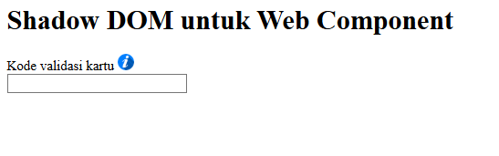
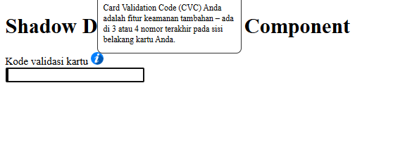

# 🛡️ Shadow DOM Web Component Project

This repository demonstrates how to build a custom, encapsulated component using Shadow DOM. The main feature is a <popup-info> element that provides a stylish, hoverable informational tooltip while keeping its styles isolated from the rest of the application.
# 🚀 Key Features

    Encapsulated Shadow DOM: Uses attachShadow({ mode: 'open' }) to ensure that component styles do not leak out and external styles do not interfere with the component.

    Custom Attributes: The component accepts dynamic inputs through img and description attributes.

    Interactive Tooltip: Built-in hover and focus states that reveal additional information smoothly.

    Fallback Mechanism: Includes a default icon if no image URL is provided.

# 📸 Preview
Component Implementation

The custom <popup-info> element integrated into a standard HTML form.
Tooltip Interaction

The tooltip appearing when the user hovers over or focuses on the info icon.

# 📁 Project Structure

.
├── screenshot/             # Application visual documentation

│   ├── popup-info.png      # Tooltip interaction preview

│   └── shadow_dom.png      # Component structure preview

├── src/                    

│   ├── css/

│   │   └── style.css       # Global application styles

│   ├── main.js             # Main entry point importing the component

│   └── popup-info.js       # The Web Component logic (Shadow DOM)

├── index.html              # Main HTML file using the custom element

└── README.md               # Project documentation

# 🛠️ Technologies Used

    HTML5 & CSS3: For the structural layout and interactive animations.

    Vanilla JavaScript (ES6+): Utilized for Custom Elements and Shadow DOM API.

    Web Components API: Defining reusable HTMLElement classes.

# ⚙️ How to Run

    Clone the Repository:
    Bash

    git clone https://github.com/ranggautama47/your-repo-name.git

    Open the Project: Open index.html directly in any modern web browser that supports Web Components.

    Note on Modules: Since the project uses type="module" in the script tag, you may need to run it via a local server (like Live Server in VS Code) to avoid CORS issues.

# 👤 Author

Developed by ranggautama47 as part of the Dicoding Indonesia learning path for Front-End Web Development.